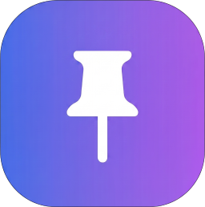

<div align="center">

<h1>
  <a href="https://github.com/Mino7406/NotiMemo/releases"></a><br>
  알림메모 (NotiMemo)
</h1>

메모를 알림창에 고정해 두고, 앱을 열지 않아도 확인하고 고치는 안드로이드 메모 앱입니다. 예약 알림, 알림 내역, 사진 글자 인식, AI 자동 정리, 홈 화면 위젯을 제공합니다. 화면은 [Flutter](https://flutter.dev/), 알림·알람·위젯은 네이티브(Kotlin)로 작성했습니다.

[](https://github.com/Mino7406/NotiMemo/releases)
[](https://flutter.dev/)
[](https://kotlinlang.org/)
[](#ai-서버-worker)


</div>

### 목차

| | 문서 | 내용 |
|:--:|---|---|
| ✨ | [주요 기능](#주요-기능) | 앱이 제공하는 기능 한눈에 보기 |
| 🧰 | [기술 스택](#기술-스택) · [폴더 구조](#폴더-구조) | 사용 라이브러리와 파일 배치 |
| 🚀 | [설치 및 실행](#설치-및-실행) | APK 설치, 직접 빌드, AI 서버 배포 |
| ⚙️ | [설정](#설정) | 설정 화면 항목과 코드 상수 |
| 🎛️ | [화면과 버튼](#화면과-버튼) | 입력창 버튼과 ☰ 메뉴 전체 표 |
| 🔍 | [기능 상세](#기능-상세) | 기능별 동작 흐름 (섹션을 눌러서 펼치기) |
| 🧩 | [주요 함수](#주요-함수) | 파일별 핵심 함수 레퍼런스 (펼치기) |
| 🗂️ | [데이터 저장](#데이터-저장) | 저장 키와 네이티브·Flutter 공유 방식 |
| 🎨 | [코드 컨벤션](#코드-컨벤션) · [권한](#권한) | 작성 규칙과 안드로이드 권한 |

---

## 주요 기능

**📌 알림 고정**

- **여러 메모 고정** — 메모마다 알림이 하나씩 뜨고, 알림의 `수정` / `지우기` 버튼으로 앱을 열지 않고 고칩니다. 알림을 밀어서 지워도 다시 게시됩니다.
- **알림 복구** — 강제 종료나 재설치로 알림이 사라지면 앱을 켤 때 저장된 목록대로 다시 게시합니다.
- **알림 진동** — 고정, 예약, 재게시 때 짧게 진동합니다(설정에서 끄기 가능).

**⏰ 예약 · 내역**

- **예약 알림** — 날짜와 시각(휠 + 직접 입력)을 정해 두면 그때 알림창에 고정됩니다. 예약 목록에서 확인하고 취소합니다.
- **알림 내역** — 지난 메모를 보고, 다시 고정하거나 예약해서 고정합니다. 개별 삭제와 전체 삭제를 지원합니다.
- **분류 · 우선순위 필터** — 내역과 예약 목록을 분류(학교/할일/약속/쇼핑/건강/돈/기타)와 우선순위로 걸러 봅니다.

**✨ 입력 · 자동 정리**

- **사진으로 메모 가져오기** — 사진 속 글자를 한국어로 읽어 입력창에 넣습니다. 기기 안에서 처리해서 인터넷이 없어도 됩니다.
- **AI 자동 정리(✨)** — 분류, 우선순위, 한 줄 요약, 일정 시각을 찾습니다. 서버가 안 되거나 동의하지 않으면 기기 안의 기본(키워드) 분석으로 대신합니다. 일정보다 몇 분 앞서 알리는 **여유 시간**을 정할 수 있습니다.
- **홈 화면 위젯** — 위젯에서 바로 메모를 고정하고 예약 목록과 알림 내역을 봅니다. 기본 4×2, 가로 5칸까지 늘릴 수 있습니다.

**🧩 편의**

- **사용 방법** — 처음 설치하면 실제 화면 위에서 버튼을 하나씩 짚어 주는 6단계 안내가 뜹니다(☰ 메뉴에서 다시 보기).
- **라이트 / 다크 테마**, **기기 언어로 표시되는 복사·붙여넣기 메뉴**, **알림 권한 안내**, **최신 버전 확인**

---

## 기술 스택

- [Flutter](https://flutter.dev/) / Dart — 화면, 저장소, 분류·시간 파서
- Kotlin — 알림 서비스, 예약 알람, 홈 화면 위젯, 빠른 입력 창
- [google_mlkit_text_recognition](https://pub.dev/packages/google_mlkit_text_recognition) ^0.17.1 — 한국어 글자 인식(기기 안에서 처리)
- [image_picker](https://pub.dev/packages/image_picker) · [permission_handler](https://pub.dev/packages/permission_handler) · [shared_preferences](https://pub.dev/packages/shared_preferences) · [package_info_plus](https://pub.dev/packages/package_info_plus) · [url_launcher](https://pub.dev/packages/url_launcher) · `flutter_localizations`
- [Cloudflare Workers AI](https://developers.cloudflare.com/workers-ai/) — 자동 정리 서버(`worker/`, Node.js 테스트)
- 데이터 저장: 별도 DB 없이 `shared_preferences`(안드로이드 SharedPreferences) 하나에 모아 둠

---

## 폴더 구조

```
NotiMemo/
├─ lib/
│  ├─ main.dart                 # 엔트리 포인트: 테마·번역 설정 후 HomeScreen 실행
│  ├─ screens/
│  │  ├─ home_screen.dart       # 홈 화면: 고정·예약·✨·사진·내역·사용 방법·권한 안내 등 대부분의 동작
│  │  └─ settings_screen.dart   # 설정: 테마, 진동, AI, 앱 정보(업데이트 확인)
│  ├─ models/                   # MemoEntry(메모), ScheduledNote(예약), MemoAnalysis(분석 결과)
│  ├─ services/
│  │  ├─ notification_service.dart  # MethodChannel로 네이티브(Kotlin) 호출, 알림 권한
│  │  ├─ ai_classifier.dart     # AI 서버 호출 + 실패 시 기본 분석으로 대체
│  │  ├─ ocr_service.dart       # 사진 선택 + ML Kit 글자 인식
│  │  └─ update_service.dart    # GitHub 최신 릴리스와 버전 비교
│  ├─ storage/                  # SharedPreferences 접근(메모/AI/설정/사용 방법 본 여부)
│  ├─ utils/                    # 시간 파서, 키워드 분류, 여유 시간, 필터, 날짜·글자 정리
│  ├─ widgets/                  # 입력 카드, 시트, 다이얼로그, 토스트, 메뉴, 코치마크 등
│  └─ theme/app_theme.dart      # 색 모음
├─ android/app/src/main/
│  ├─ kotlin/com/example/notimemo/
│  │  ├─ NotiMemoService.kt     # 고정 메모마다 알림 1개 게시, 지우기·수정·재게시 처리
│  │  ├─ AlarmScheduler.kt      # 예약 알람 등록·발동, 재부팅/업데이트 후 복원(AlarmReceiver, BootReceiver 포함)
│  │  ├─ NotiMemoWidget.kt      # 홈 화면 위젯 + 목록 서비스
│  │  ├─ QuickInputActivity.kt  # 위젯 입력줄을 누르면 뜨는 작은 입력 창
│  │  ├─ WidgetRows.kt          # 위젯 목록 줄을 JSON에서 만드는 순수 함수
│  │  └─ MainActivity.kt        # Flutter ↔ 네이티브 통신(MethodChannel)
│  └─ res/                      # 위젯 레이아웃·색(라이트/다크)·스타일
├─ worker/                      # AI 분류 서버(Cloudflare Workers AI)
│  ├─ src/index.js              # 요청 처리: 크기·JSON 확인 → 횟수 제한 → AI 호출 → 결과 정리
│  └─ src/classify.js           # 분류 기준·프롬프트·결과 검증
├─ test/                        # 자동 테스트(`flutter test`)
├─ assets/                      # Caveat 손글씨 폰트(OFL), 런처 아이콘 원본(icon.png), README용 축소 아이콘(readme_icon.png)
└─ PLAN.md                      # 개발 기록과 구조 메모
```

---

## 설치 및 실행

[Releases](https://github.com/Mino7406/NotiMemo/releases)에서 최신 APK를 받아 안드로이드 기기에 설치합니다. 갤럭시(One UI, Android 16)에서 테스트했습니다.

> [!IMPORTANT]
> **v2.6.0을 쓰던 분은 삭제 후 다시 설치해 주세요.** 배포용 서명 키가 바뀌어서 이전 앱 위에는 덮어쓸 수 없습니다.

> [!NOTE]
> 알림을 고정하려면 **알림 권한**이 필요합니다. 처음 설치하면 사용 방법 안내가 끝난 뒤 권한 창이 뜨고, 꺼져 있으면 `설정` 버튼이 달린 안내가 계속 표시됩니다.

직접 빌드하려면:

```bash
flutter pub get
flutter test
flutter run --release
```

배포용 APK는 서명 키가 필요합니다. 키스토어(`*.jks`)와 `android/key.properties`는 `.gitignore`로 저장소에서 제외되어 있으며, 없으면 debug 키로 서명됩니다.

> [!WARNING]
> debug 키로 서명한 APK는 배포 키로 설치된 앱 위에 덮어쓸 수 없습니다. 폰에 설치할 때는 같은 키로 서명한 빌드를 사용하세요.

### AI 서버 (`worker/`)

앱이 호출하는 서버 코드입니다. 직접 배포하려면:

```bash
cd worker
npm install
npm test          # node --test
npx wrangler deploy
```

배포 후 나온 주소를 [`lib/services/ai_classifier.dart`](lib/services/ai_classifier.dart)의 `defaultEndpoint`에 넣습니다. `wrangler.toml`의 `MODEL`로 모델을 바꿀 수 있고, 짧은 시간 폭주를 막는 `LIMITER`(60초에 6회)가 들어 있습니다.

> [!TIP]
> **VPN을 켜면 AI 서버에 연결되지 않아** 기본 분석으로 넘어갑니다. VPN을 끄거나 이 앱을 VPN 제외 앱에 추가하세요.

---

## 설정

설정 화면(☰ → 설정)에서 바꾸는 값입니다.

| 항목 | 설명 | 기본값 |
|---|---|---|
| 테마 | 시스템 기본 / 라이트 / 다크 | 시스템 기본 |
| 알림 진동 | 고정·예약·재게시 때 60ms 진동 | 켜짐 |
| AI 기능 켜기 | 켜면 ✨가 서버 분석을 사용. 켜는 순간 "메모가 외부 서버로 전송된다"는 안내와 동의를 받음 | 꺼짐(미동의) |
| 자동 분류 시스템 | AI를 켠 경우에만 표시. 끄면 ✨는 메모 속 예약 시각만 찾고 서버로 보내지 않음 | 켜짐 |
| 여유 시간 | AI·기본 분석이 찾은 일정 시각의 몇 분 전에 알릴지(안 함 / 5분 / 10분 / 30분 / 1시간 / 2시간 / 직접 입력, 최대 24시간) | 30분 |
| 앱 정보 | 버전, `업데이트 확인`, 문의 | - |

코드 상수(앱 안에서 바꾸는 값이 아님):

| 상수 | 위치 | 설명 |
|---|---|---|
| `AiClassifier.releaseDailyLimit` | `services/ai_classifier.dart` | 기기당 하루 서버 호출 상한(20). 서버 시도는 성공 여부와 무관하게 센다 |
| `AiClassifier.timeout` | 같은 파일 | 서버 응답 대기 시간(8초). 넘으면 기본 분석으로 대체 |
| `_inputMinLines` | `widgets/home_widgets.dart` | 입력창 최소 줄 수(6). 글이 길어지면 제한 없이 늘어남 |
| `_footerFadeStart` / `_footerFadeEnd` | `screens/home_screen.dart` | 아래 손글씨 문구가 서서히 사라지는 구간 |
| `_scrollFadeHeight` | 같은 파일 | 스크롤할 때 내용이 고정 영역과 만나는 곳에서 옅어지는 높이(28) |

---

## 화면과 버튼

| 위치 | 버튼 | 동작 |
|---|---|---|
| 입력창 | **[알림 고정하기]** | 메모를 알림창에 고정하고 내역에 저장 |
| 입력창 | **[알림 지우기]** / **[모두 지우기]** | 고정된 알림을 내림(여러 개면 전부) |
| 입력창 오른쪽(글이 있을 때) | **✕** | 새 메모 지우기(글이 있으면 확인 창, 공백뿐이면 바로 비움) |
| 입력창 오른쪽 | **✨** | AI 자동 정리 → 결과 시트에서 적용·예약 |
| 입력창 오른쪽 | **🕒** | 예약 생성 |
| 상단 | **☰** | 오른쪽 슬라이드 메뉴 |
| ☰ 메뉴 | AI 자동 정리 · 사진으로 메모 가져오기 | 입력창 기능을 메뉴에서도 실행 |
| ☰ 메뉴 | 예약 생성 · 예약 목록 | 예약 시트, 예약 목록 하단 시트 |
| ☰ 메뉴 | 알림 내역 | 내역 하단 시트(다시 고정 ↻, 삭제 ✕, 전체삭제) |
| ☰ 메뉴 | 설정 · 사용 방법 | 설정 화면 · 코치마크 안내 다시 보기 |
| 홈 화면 위젯 | 입력줄 / `예약` · `내역` 탭 / 목록 항목 | 빠른 입력 창 / 위젯 안 목록 전환 / 앱에서 해당 목록 열기 |

---

## 기능 상세

> [!TIP]
> 항목 제목을 클릭하면 상세 내용이 펼쳐집니다.

<details>
<summary>📌 <b>알림 고정</b> <sub><code>NotiMemoService.kt</code>, <code>home_screen.dart</code></sub></summary>

1. 메모를 쓰고 **[알림 고정하기]** → 알림 권한 확인(없으면 요청, 막혀 있으면 안내)
2. Flutter가 MethodChannel `show`로 네이티브에 `{id, memo, time}` 전달
3. `NotiMemoService`가 고정 목록(`pinned_notes`)에 추가하고 메모마다 알림 1개를 게시합니다. 첫 알림은 포그라운드 서비스(앵커)로, 나머지는 일반 `notify`로 올립니다.
4. 알림 버튼: **수정**(알림 안에서 바로 입력 → 고정 목록과 앱 내역에 반영), **지우기**(그 알림만 내림). 알림을 밀어서 지우면 `deleteIntent`로 다시 게시합니다.
5. 앵커 알림이 지워지면 다른 알림으로 앵커를 옮깁니다. 고정 목록이 비면 서비스를 끝냅니다.
6. 앱을 켤 때 고정 목록은 있는데 우리 알림이 하나도 없으면(`restorePinnedIfMissing`) 저장된 목록대로 다시 게시합니다.

</details>

<details>
<summary>⏰ <b>예약 알림</b> <sub><code>AlarmScheduler.kt</code>, <code>schedule_sheet.dart</code></sub></summary>

1. 🕒 → 날짜 휠(약 1년) + 오전/오후 + 시(1~12)·분(0~59) 입력 칸으로 시각을 고릅니다. 지난 시각은 확인할 수 없습니다.
2. **정확한 알람(`알람 및 리마인더`) 권한**이 없으면 안내하고 설정 화면을 엽니다. 거절해도 예약은 계속되지만 몇 분 늦을 수 있습니다.
3. 네이티브 `schedule`이 예약 목록(`scheduled_notes`)에 저장하고 `AlarmManager`에 등록합니다(권한이 있으면 정확한 알람).
4. 시각이 되면 `AlarmReceiver` → `fire`가 예약을 목록에서 빼고 메모를 고정합니다. 포그라운드 서비스를 시작할 수 없으면(부팅 직후 등) 일반 알림으로 알립니다.
5. 재부팅·앱 업데이트 뒤에는 `BootReceiver`가 알람을 다시 등록합니다. 이미 지난 예약은 바로 게시합니다.
6. 예약 목록에서 ✕로 취소하거나 행 옆으로 밀어서 취소합니다(행을 눌러도 취소되지 않음).

</details>

<details>
<summary>🗂️ <b>알림 내역 · 예약 목록</b> <sub><code>history_sheet.dart</code>, <code>scheduled_sheet.dart</code>, <code>memo_list_row.dart</code></sub></summary>

- 두 목록은 같은 행 위젯(`MemoListRow`)을 씁니다: `분류 · 우선순위` / 메모 / 시간 순으로 표시하고, 아이콘은 메모 첫 줄 높이에 맞춥니다.
- 위쪽에 `분류`·`우선순위` 칩 필터가 붙습니다(항목이 2개 미만이거나 분류된 항목이 없으면 숨김). 필터가 걸린 상태에서도 삭제는 원래 목록의 위치로 처리합니다(`visibleIndexes`).
- 내역 행의 **↻**는 `취소 / 예약해서 고정 / 바로 고정` 중에서 고르며, 예약해서 고정은 분류·우선순위를 유지합니다.
- `전체삭제`는 확인 창을 거치고, 필터를 건 채여도 보이는 것만이 아니라 전체가 대상입니다.
- 예전 기록에 분류가 없으면 앱을 열 때 기본 분석으로 한 번 채웁니다(`backfillClassification`). 설정에서 AI를 켜고 자동 분류를 끈 경우에는 채우지 않습니다.

</details>

<details>
<summary>📷 <b>사진으로 메모 가져오기</b> <sub><code>ocr_service.dart</code>, <code>ocr_text.dart</code></sub></summary>

1. ☰ → `사진으로 메모 가져오기` → 카메라 촬영 / 갤러리 선택
2. ML Kit 한국어 모델로 글자를 읽고, `cleanOcrText`가 줄 끝 공백·연속 빈 줄·앞뒤 빈 줄을 정리합니다.
3. 새 메모가 비어 있으면 바로 채우고, 이미 글이 있으면 **"기존 메모를 지우고 불러오시겠습니까?"** 토스트로 먼저 묻습니다(적용하면 사진 글자로 대체).
4. 채워진 뒤 ✨ 버튼을 가리키는 반투명 말풍선("AI가 자동으로 분석해줘요!")이 12초간 깜빡입니다(누를 수 없는 안내).
5. 사진 원본은 저장하지 않고, 임시 파일은 인식 직후 지웁니다.

</details>

<details>
<summary>✨ <b>AI 자동 정리</b> <sub><code>ai_classifier.dart</code>, <code>rule_classifier.dart</code>, <code>worker/</code></sub></summary>

1. ✨ → 처음이면 동의 창(메모가 외부 서버로 전송됨, 기기당 하루 20회 안내). 동의/거부는 저장되고 설정에서 바꿉니다.
2. `AiClassifier.analyze`가 순서대로 확인합니다: 동의 여부 → 오늘 사용 횟수 → 서버 호출(`X-Device-Id` 헤더에 설치별 무작위 id). 서버에 닿는 시도는 성공 여부와 무관하게 횟수를 셉니다.
3. 서버는 메모를 분류(`학교/할일/약속/쇼핑/건강/돈/기타`), 우선순위(`low/normal/high`), 한 줄 요약(30자 이내, 25자 이하 짧은 메모는 요약 없음)으로 돌려줍니다.
4. 어떤 단계든 실패하면 예외 없이 **기본(키워드) 분석**(`classifyByRules`)으로 대신하고, 이유를 사용자에게 알립니다: 동의 안 함 / 하루 횟수 소진 / 오프라인 / 응답 지연 / 서버 사용량 소진 / 요청 과다 / 서버 오류.
5. 결과 시트: 분류·우선순위·요약·일정 시각과 함께 `AI 분석` / `기본 분석` 표시. **적용**하면 요약이 있을 때 입력창 메모가 요약으로 바뀌고 `되돌리기` 토스트(6초)로 원문을 되살릴 수 있습니다(요약을 고쳤다면 덮어쓰지 않음).
6. 일정 시각이 있으면 `suggestReminder`가 여유 시간만큼 앞당긴 시각을 예약 시각으로 제안합니다("알림은 30분 전(…)으로 맞춰 드려요").

</details>

<details>
<summary>🕘 <b>시간 파서</b> <sub><code>due_parser.dart</code>, <code>reminder_time.dart</code></sub></summary>

- 일정 시각은 **서버가 아니라 앱의 규칙 기반 한국어 파서**가 계산합니다. LLM이 요일 표현을 한 주 뒤로 잘못 계산하는 경향이 있었고, 오프라인에서도 같은 결과가 나와야 하기 때문입니다.
- 읽는 표현: `30분 뒤` / `2시간 후` / `1시간 30분 뒤`, `오늘` `내일` `낼` `모레` `글피`, `10월 15일` / `2027년 3월 5일`, 요일(`금요일`, `다음주 월요일`, `담주 수욜`, `이번주말`), `오후 3시 30분` / `저녁 7시` / `3시 반`, `정오` `자정`, 시간대 단어(`내일 저녁`).
- 시각 없이 날짜만 있으면 오전 9시로 채우고(`hasTime: false`), 반복 일정(`매주 …`)이나 확실하지 않은 표현은 **`null`**로 돌려 예약을 제안하지 않습니다(잘못된 알림이 더 해롭기 때문).
- `suggestReminder`는 일정 시각의 N분 전을 알림 시각으로 제안합니다. 이미 지났으면 5분 뒤(일정이 5분 안쪽이면 일정 시각)로 당기고, 시각 없는 일정은 그대로 둡니다.

</details>

<details>
<summary>🧩 <b>홈 화면 위젯</b> <sub><code>NotiMemoWidget.kt</code>, <code>QuickInputActivity.kt</code>, <code>WidgetRows.kt</code></sub></summary>

1. 위쪽 입력줄을 누르면 앱 전체가 아니라 **작은 입력 창**(`QuickInputActivity`)이 뜹니다. `알림 고정하기`를 누르면 서비스를 시작하고, 앱 내역(`memo_list`) 맨 앞에 새 항목을 넣고, 진동 설정을 따릅니다. 알림 권한이 없으면 앱을 엽니다.
2. `예약` / `내역` 탭은 위젯 안에서 목록(`NotiMemoWidgetService`)만 바꿉니다. 마지막으로 고른 탭은 따로 저장합니다.
3. 목록 항목을 누르면 앱이 열리고(`open` extra), 그 탭에 맞는 시트(`scheduled` / `history`)가 바로 열립니다.
4. 데이터가 바뀌면(`예약 저장`, `내역 저장`, `알림에서 수정`) `NotiMemoWidget.refresh`로 다시 그리고, Flutter 쪽은 `refreshWidget` 채널을 부릅니다. 안전장치로 30분마다도 갱신합니다.
5. 기본 4×2, 가로 4~5칸, 세로는 자유입니다. 라이트/다크는 리소스 한정자(`values-night`)로 따릅니다.

</details>

<details>
<summary>🎓 <b>사용 방법 (코치마크)</b> <sub><code>coach_mark.dart</code>, <code>home_screen.dart</code></sub></summary>

- 실제 홈 화면 위에 어두운 막을 씌우고 대상만 둥근 구멍으로 밝혀 6단계를 안내합니다: 입력창 → 알림 고정하기 → ✨ → 🕒 → ☰ 메뉴(메뉴를 실제로 열어 보여 줌) → 알림창에서 수정·지우기.
- 대상은 `Key`로 찾습니다(`input-card`, `pin-button`, `card-analyze`, `card-schedule`, `menu-drawer`). ✨·🕒는 글이 있어야 보이므로 안내 동안 샘플 문구를 임시로 넣고, 끝나면 원래 글로 되돌립니다.
- `이전` / `다음` / `건너뛰기`가 있고, 처음 설치할 때만 자동으로 뜹니다(`tutorial_seen`). 이미 쓰던 흔적(내역·고정·예약)이 있으면 본 것으로 처리합니다.
- 알림 권한 요청은 이 안내가 끝난 뒤에 합니다.

</details>

<details>
<summary>🔔 <b>권한 안내 · 업데이트 확인</b> <sub><code>notification_service.dart</code>, <code>update_service.dart</code></sub></summary>

- **권한 안내**: 알림 권한이 꺼져 있으면 `알림 권한이 꺼져 있어요.` 토스트가 닫을 때까지 남고, `설정`을 누르면 권한 요청 창을 다시 띄웁니다("다시 묻지 않음"으로 막혀 있으면 앱 설정 화면). 앱을 열 때와 설정에서 돌아왔을 때 다시 확인합니다.
- **업데이트 확인**(설정 → 앱 정보): GitHub 최신 릴리스 태그와 현재 버전을 점(.)으로 나눠 앞자리부터 비교합니다. 새 버전이면 안내 창(`업데이트`를 누르면 릴리스 페이지), 최신이면 토스트, 실패하면 오류 토스트를 보여 줍니다. 앱을 켤 때는 새 버전이 있을 때만 조용히 안내합니다.

</details>

---

## 주요 함수

> [!TIP]
> 파일명을 클릭하면 함수 표가 펼쳐집니다.

<details>
<summary>📄 <b><code>services/notification_service.dart</code> — 네이티브 창구</b></summary>

| 함수 | 설명 |
|---|---|
| `show(entry)` / `cancel([id])` | 메모를 고정 / 해제(id가 없으면 전부) |
| `schedule(entry, at)` / `cancelSchedule(id)` | 예약 알람 등록 / 취소 |
| `canScheduleExact()` / `requestExactAlarm()` | 정확한 알람 권한 확인 / 설정 화면 열기 |
| `ensurePermission()` | 알림 권한 확인·요청. 사용 가능하면 `null`, 아니면 보여줄 오류 문구 |
| `requestOrOpenSettings()` | 권한 요청 창을 다시 띄움. 막혀 있으면 앱 설정 화면 |
| `restorePinned()` | 고정 목록은 있는데 알림이 없으면 다시 게시 |
| `vibrate()` | 설정이 켜져 있으면 60ms 진동 |
| `refreshWidget()` | 홈 화면 위젯 목록 다시 그리기 |
| `listenForChanges(onChanged, {onOpenTarget})` | 네이티브가 알리는 "고정 상태 변경"과 "위젯에서 열기" 수신 |
| `launchTarget()` | 위젯에서 눌러 앱이 새로 켜졌을 때 열어야 할 화면(한 번 읽으면 비워짐) |

</details>

<details>
<summary>📄 <b><code>services/ai_classifier.dart</code> — AI 분석</b></summary>

| 함수 | 설명 |
|---|---|
| `analyze(memo, {now})` | 동의 → 하루 횟수 → 서버 호출 순서로 진행하고, 실패하면 `classifyByRules`로 대체(예외를 던지지 않음) |
| `_parse(body, memo, now)` | 서버 응답 검증. 모르는 분류는 `기타`, 짧은 메모는 요약을 비움, 일정 시각은 `parseDue`로 계산 |
| `_reasonForError(response)` | 429(`quota_exceeded` / 일반 제한)와 그 밖의 오류를 사용자에게 보여줄 이유로 변환 |

</details>

<details>
<summary>📄 <b><code>utils/</code> — 파서·분류·표시</b></summary>

| 함수 | 설명 |
|---|---|
| `parseDue(memo, now)` | 메모에서 일정 시각을 찾아 `ParsedDue(at, hasTime)` 반환. 불확실하면 `null` |
| `suggestReminder(due, now, {leadMinutes})` | 여유 시간만큼 앞당긴 알림 시각 제안 |
| `leadLabel(lead)` | `30분 전`, `1시간 30분 전` 같은 표시 문구 |
| `classifyByRules(memo, now)` | 키워드로 분류·우선순위·요약·일정을 만든 기본 분석 |
| `withRuleClassification(entry, now)` / `backfillClassification(list, now)` | 분류가 없는 메모 하나 / 옛 내역 전체를 기본 분석으로 채움 |
| `ClassFilter` / `visibleIndexes(items, filter, classOf)` | 분류·우선순위 필터와 필터를 통과한 항목의 원래 위치 |
| `cleanOcrText(raw)` | 인식된 글자의 줄 끝 공백·빈 줄 정리 |
| `formatEntryTime(ms)` / `dateLabel(d, today)` | 목록용 시각 / `10월 2일 (금)` 날짜 표기 |

</details>

<details>
<summary>📄 <b><code>storage/</code> — 저장소</b></summary>

| 함수 | 설명 |
|---|---|
| `MemoStorage.getList()` / `saveList(list)` | 내역 읽기(옛 형식 3종 호환) / 저장하고 위젯 갱신 |
| `MemoStorage.getPinnedIds()` / `getScheduled()` | 네이티브가 기록한 고정·예약 목록을 읽음(읽기 전 `reload`) |
| `MemoStorage.getCurrent()` / `setCurrent(memo)` | 입력창에 쓰던 글 임시 저장 |
| `AiStorage.usageToday(now)` / `addUsage(now)` | 오늘 서버 호출 횟수 조회 / 증가(날짜가 바뀌면 0부터) |
| `AiStorage.getDeviceId()` | 설치별 무작위 24자 id(안드로이드 고유 번호 아님) |
| `AiStorage.classificationEnabled()` | 저장 때 분류를 자동으로 채워도 되는지(AI를 쓰지 않으면 항상 허용) |

</details>

<details>
<summary>📄 <b>네이티브(Kotlin)</b></summary>

| 클래스 / 함수 | 설명 |
|---|---|
| `NotiMemoService.onStartCommand` | 명령(`STOP`, `STOP_ALL`, `EDIT`, `REPOST`, 새 고정)을 처리 |
| `NotiMemoService.post` / `buildNotification` | 알림 게시(앵커 / 일반)와 모양(제목, 굵은 메모, `수정` `지우기` 버튼) |
| `AlarmScheduler.schedule` / `cancel` / `fire` / `restoreAll` | 예약 등록 · 취소 · 발동 · 재부팅 후 복원 |
| `NotiMemoWidget.refresh(ctx)` | 모든 위젯과 목록 다시 그리기(위젯이 없으면 아무것도 안 함) |
| `QuickInputActivity.pin` | 권한 확인 → 서비스 시작 → 내역 추가 → 위젯 갱신 |
| `WidgetRows.scheduled` / `history` | 위젯 목록 줄을 JSON에서 만듦(깨진 JSON이면 빈 목록) |
| `MainActivity` 채널 메서드 | `show` `cancel` `schedule` `cancelSchedule` `canScheduleExact` `requestExactAlarm` `vibrate` `restorePinned` `refreshWidget` `getLaunchTarget` |

</details>

---

## AI 서버 (`worker/`)

- `POST /classify` — 본문 `{ "memo": "..." }`(4096바이트 이하, 메모 500자 이하) → `{ category, priority, summary }`
- `GET /health` — 상태 확인
- 오류는 `{ "error": 코드 }` 모양입니다: `body_too_large` · `bad_json` · `bad_request` · `empty_memo` · `memo_too_long` · `rate_limited`(분당 6회) · `quota_exceeded`(Workers AI 하루 무료 한도 소진) · `ai_failed` · `bad_model_output` · `not_found` · `method_not_allowed` · `internal_error`. 앱은 이 코드를 보고 기본 분석으로 넘어가는 이유 문구를 고릅니다.
- 메모 내용은 로그에 남기지 않고, 앱이 보내는 것은 동의한 메모 본문과 설치별 무작위 id뿐입니다.
- 분류 목록(`CATEGORIES`)은 앱의 `memoCategories`와 같아야 합니다. 한쪽을 바꾸면 다른 쪽도 맞추세요.

---

## 데이터 저장

모든 데이터는 안드로이드 SharedPreferences 한 곳에 있습니다(Flutter에서는 `shared_preferences`, 네이티브에서는 `FlutterSharedPreferences` 파일의 `flutter.` 접두 키).

| 키 | 내용 | 쓰는 쪽 |
|---|---|---|
| `pinned_notes` | 고정 중인 메모 `[{id, memo, time}]` | **네이티브만 씀**, Flutter는 읽기만 |
| `scheduled_notes` | 예약 목록 `[{id, memo, at}]` | **네이티브만 씀**, Flutter는 읽기만 |
| `memo_list` | 알림 내역(메모, 분류, 우선순위, 요약, 예약 시각). 알림에서 고친 내용과 위젯 빠른 입력은 네이티브가 같은 항목에 반영 | Flutter(+네이티브가 일부 수정) |
| `saved_memo` | 입력창에 쓰던 글 임시 저장 | Flutter |
| `ai_consent` · `ai_device_id` · `ai_usage_date` · `ai_usage_count` · `ai_lead_minutes` · `ai_auto_classify` | AI 동의, 설치 id, 오늘 사용 횟수, 여유 시간, 자동 분류 | Flutter |
| `theme_mode` · `vibration_on` · `tutorial_seen` | 테마, 진동, 사용 방법을 봤는지 | Flutter |

- 앱이 꺼져 있어도 알림에서 지우기·수정이 되고 예약이 발동해야 해서 **고정·예약 목록은 네이티브가 소유**합니다. Flutter는 읽기 전에 `reload()`로 네이티브가 바꾼 값을 가져옵니다.
- 메모 id는 생성 시각(마이크로초) 기반 문자열입니다. 옛 형식(글자만 저장 / `{memo, time}`)은 읽을 때 변환하고, 새 필드는 기본값이 아닐 때만 기록해서 옛 버전 앱이 읽어도 깨지지 않게 합니다.

---

## 코드 컨벤션

- **주석과 커밋 메시지는 한국어**로 짧게 씁니다. 거창한 설명 대신 "무엇을 하는지" 한 줄이면 충분합니다.
- **`dart format`은 파일을 지정해서만** 씁니다. 폴더째 돌리면 손대지 않은 파일의 줄바꿈까지 바뀝니다.
- 파일은 CRLF(윈도우)입니다. 문자열을 코드로 치환할 때는 `\r\n`을 `\n`으로 바꿔 비교하고, 한글 문자열 안의 `\n`이 실제 줄바꿈으로 들어가지 않게 조심합니다.
- 멀티라인 `TextField`가 들어 있는 화면에는 `IntrinsicHeight`나 `SliverFillRemaining(hasScrollBody: false)` 안의 `Column`을 쓰지 않습니다. 높이를 잘못 재서 아래쪽이 잘립니다.
- 프레임 처리 중(persistent frame callback)에 `setState`를 하면 다음 프레임이 예약되지 않으므로 `addPostFrameCallback`으로 합니다.
- 테스트(`flutter test`)는 기능을 바꿀 때 같이 고칩니다. 알림·알람·위젯 같은 네이티브 동작은 자동 테스트가 어려워 실기기로 확인합니다.
- 윤곽선 버튼(`NoticeButton`)은 안내 창에서 항상 테두리를 두어 눌러야 하는 곳이 눈에 보이게 합니다.

---

## 권한

| 권한 | 용도 |
|---|---|
| `POST_NOTIFICATIONS` | 알림 게시(안드로이드 13+) |
| `FOREGROUND_SERVICE` · `FOREGROUND_SERVICE_MEDIA_PLAYBACK` | 고정 알림을 서비스로 유지해서 시스템이 알림을 정리하지 못하게 함 |
| `SCHEDULE_EXACT_ALARM` | 예약 시각에 정확히 고정(없으면 몇 분 늦을 수 있음) |
| `RECEIVE_BOOT_COMPLETED` | 재부팅·앱 업데이트 뒤 예약 알람 복원 |
| `VIBRATE` | 고정·예약 때 진동 |
| `INTERNET` | AI 자동 정리와 업데이트 확인 |

- 사진은 시스템 카메라/갤러리 선택 화면을 쓰므로 별도 카메라 권한을 요청하지 않습니다.
- AI 서버에 보내는 것은 **동의한 사용자의 메모 본문과 설치별 무작위 id뿐**입니다. 동의하지 않았거나 "자동 분류"를 끈 경우 서버로 보내지 않습니다.

---

made by Mino7406, VVYUNS
